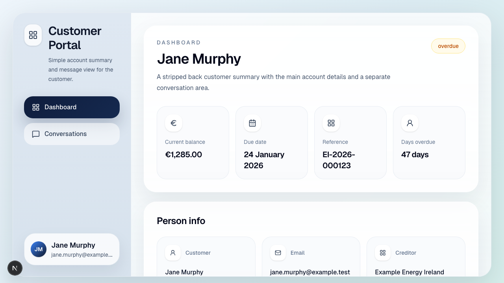

# Debtor Portal Challenge

Continue building this repo into a small but production-minded debtor portal chat experience that helps a debtor resolve their account.

## Start here

The easiest way to get set up is to create your own private copy of this repo first, then run it locally:

1. On GitHub, click the green `Use this template` button.
2. Create a new repository from this template.
3. Set the new repository visibility to `Private`.
4. Clone your new repository to your machine.
5. `cd` into the repository.
6. Run `pnpm i`.
7. Run `pnpm dev`.
8. Open `http://localhost:3000` in your browser, or use the next available port shown by Next.js.

## UI preview

This is what the starter UI looks like before you begin extending it:

## Recommended: deploy to Vercel immediately

It is worth wiring up deployment before you start building so you always have a live URL to test and share.

1. Create a Vercel account at [vercel.com](https://vercel.com/) if you do not already have one.
2. In Vercel, click `Add New...` and choose `Project`.
3. Import the GitHub repository you created from this template.
4. Review the default settings and click `Deploy`.
5. Once deployment finishes, use the live URL to verify the app is up.
6. After that, every push to GitHub will automatically trigger an updated Vercel deployment.

## The task

Use the existing implementation in this repository as your starting point. You should extend it into a simple but credible debtor self-service flow.

A debtor opens the portal and sends a message such as:

- "I can pay this now"
- "I can pay next Friday"
- "I need a payment plan"
- "Why is this amount different from last month?"
- "This balance is wrong"
- "Can someone help me?"

Your system should turn the message into a clear, structured outcome and route the debtor into one of these paths:

- Pay now
- Promise to pay
- Payment arrangement
- Question
- Dispute or human support

## Minimum expected behaviour

### Pay now

- Detect immediate payment intent
- Route to a mocked or sandbox payment flow. [Stripe](https://stripe.com/) is a straightforward option if you want to simulate a test payment in a sandbox environment, otherwise a mocked payment flow is also fine.

### Promise to pay

- Detect a single future payment commitment
- Capture at least a payment date
- Show a confirmation summary

### Payment arrangement

- Detect intent to pay over time
- For example, a debtor might pay 50% now and the remaining 50% over a fixed schedule such as 3 weekly or monthly installments
- Capture a simple proposed arrangement
- Show a confirmation summary

### Question

- Answer a relevant account question using the provided account context
- Then steer the debtor back toward resolution where appropriate

### Dispute or human support

- Route disputes, sensitive issues, or unclear or high-risk cases to human review
- A simple acknowledgement is enough here, for example: "Thanks for flagging this. I'm handing this off to a colleague who can help, and we'll be in touch soon with an update."
- Do not attempt full automated resolution for these cases

## LLM guidance

In production, we would likely recommend an LLM for parsing free-text debtor messages into structured intent and relevant details.

After that, you can use an LLM again or whatever approach you think is best for the product and risk profile.

It matters less which implementation path you choose and more that the system triages debtors effectively, safely, and clearly.

Keep the decisioning controlled and explainable, with sensible fallback behaviour for low-confidence or ambiguous cases.

## Technical expectations

- Build on top of this repository rather than starting from scratch
- Use a database for persistence
- Supabase is recommended, but not required if you can justify an alternative
- Keep the routing and state transitions understandable and testable

## What is already provided

- A Next.js app with a debtor portal UI
- A fixture-backed account summary using `fixtures/debtor-standard.json`
- Deterministic placeholder chat behaviour in `src/components/debtor-portal.tsx`
- A Conversations view where you can see the AI messaging experience in the UI; you will need to implement the backend that powers real conversation handling
- Supabase environment scaffolding for later persistence work

## Deliverables

Submit:

- source code in this repository
- setup instructions
- a deployed version of the application, with the live URL linked from `README.md`
- an updated `README.md` that includes a short design note of no more than 800 words covering architecture, tradeoffs, assumptions, and how you would improve, monitor, and evolve the system over time
- an architecture diagram saved in the repo root as `architecture-diagram.png`, `architecture-diagram.pdf`, or `architecture-diagram.md`. This can be a hand-drawn picture or something made in a free tool like [Excalidraw](https://excalidraw.com/); it does not need to be perfect, it just needs to illustrate the overall system clearly
- tests for the core decision logic

Your `README.md` should link to the architecture diagram if you include one.
Your `README.md` should also link to the deployed application URL.

Your write-up should explicitly answer the question: how can you improve and monitor this system over time?

## Use of AI coding tools

You may use tools such as Claude Code, Codex, Cursor, or similar. We encourage effective use of these tools.

However, you are responsible for the submission and should be able to explain:

- how the system works
- the key design decisions
- where AI tools helped
- what you reviewed or changed yourself

## What we're evaluating

- product and engineering judgment
- clarity of triage behaviour
- effectiveness of the triage approach, regardless of implementation style
- quality of backend logic and data modelling
- handling of ambiguous input
- code quality and structure
- test quality
- clarity of explanation
- quality of the suggested iteration path over time

## Provided input data

We will provide sample JSON files containing debtor account context for the chat experience.

Current fixtures live in `fixtures/`.

## Submission notes

- Use the GitHub `Use this template` button to create your own repository from this starter before you begin
- Set the new repository visibility to `Private`
- Do not push your submission to the shared source repository
- Treat your private copy of this repository as the submission artifact
- When you are finished, invite `wardch` as a collaborator so the submission can be reviewed
- Keep your write-up in `README.md` so reviewers can find it immediately
- Deploy the app with [Vercel](https://vercel.com/) so reviewers can try it easily
- Include the deployed URL prominently in `README.md`
- Put the architecture diagram in the repo root and reference it from `README.md`
- If you make reasonable scope cuts, document them clearly

Use the `Conversations` section in the portal UI to see the AI messaging flow on the frontend. The backend/API for real message processing is not implemented yet.

## Project structure

- `src/app/page.tsx` wires the standard fixture into the main portal UI
- `src/components/debtor-portal.tsx` contains the current page layout, chat state, and placeholder routing behaviour
- `src/lib/supabase/client.ts` provides a browser client factory for later integration
- `fixtures/` contains the provided debtor account data
